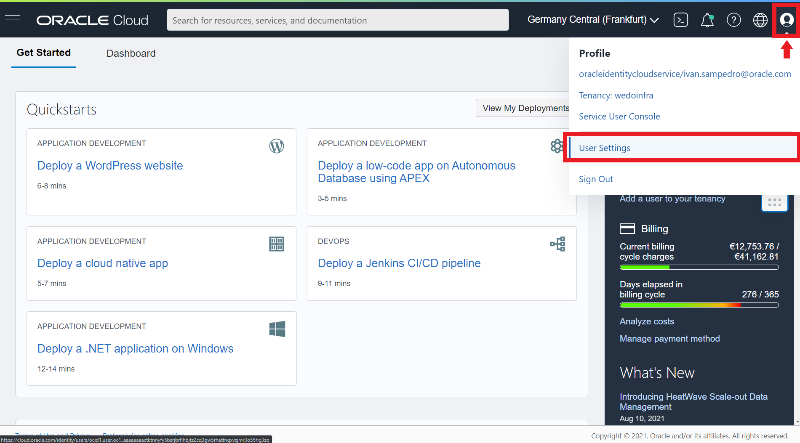
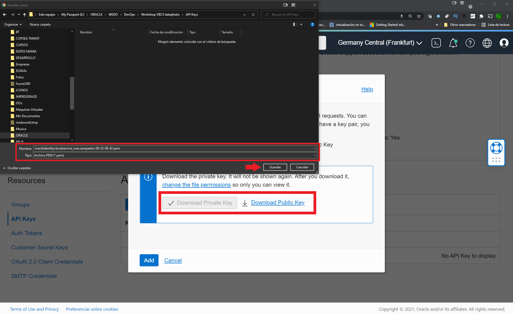
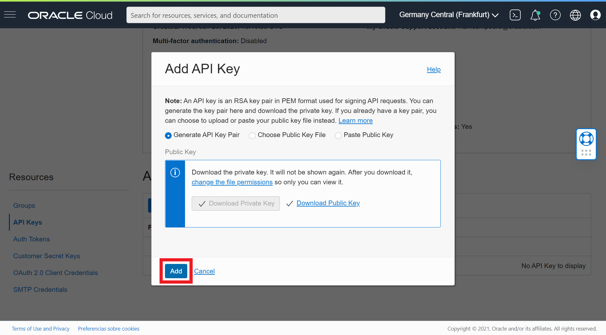
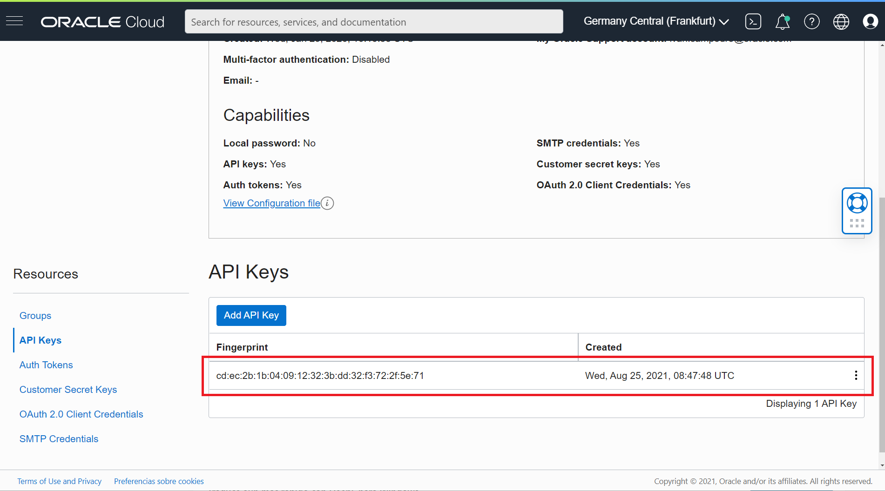

# Creation and Configuration of the OCI Storage Bucket
In this chapter we will configure the Oracle Cloud (OCI) Object Storage Bucket that will allow you to store and retrieve the documents by our Oracle Visual Builder Web application. This actions are executed by the Web Application in sync with the creation of the HASH of the document which will be stored in Blockchain during the upload of the document to the Bucket, and the verification of the validity of the hash when the document is downloaded.

To enable the usage of the Buckets through the API REST offered by Oracle Cloud (OCI) Object Storage Buckets, we will need to create an OCI API Key related with user allowed to execute the REST API, so ohere below the two configuration tasks to be execute to be able to use the OCI Buckets in our VBCS Web Application:

  
1.- Creating the OCI API Key (click to show)

---
You will have to connect the Visual Builder app to OCI Object Storage Bucket to Store the mobile photos or image files in a bucket. You must create an OCI API Key to get access to the OCI Services via API REST. So let's create the API Key.
  
---
  
## Creating the API Key
First Sign in [OCI web console](https://cloud.oracle.com) with your credentials 
> Note: this credentials will be provided to you in the workshop by the trainers, or you can use youw own credentials if you have a trial or paid tenancy.

Write your tenancy name and click **Next** Button.

Then click Continue leaving the Identity Providers as *oracleidentitycloudservice*

Next write you *User Name* and *Password* and click in **Connect** Button to access to OCI web console.

Then click in the **Profile icon** at the top right of the console to access to the user **Settings**.

Scroll down and click **API Keys** in the *Resources menu*

Next click **Add API Key** button to add a new API Key.

Select **Generate API Key Pair**. 
> Note: you could use your own public and private keys in pem format, but in this workshop and for academical purposes we'll use the auto generathed keys.

Next you must to download the *Private* and *Public* Keys to your laptop/desktop.

After that, you might have two **.pem** files one mark as public.

Then click in **Add** button.

Next window is the summary or **Configuration File Preview**. Click in the **copy** link to copy your OCI API credentials to a text file in your local computer as you will need them in future steps in the workshop. Then click **Close** Button to finish the process.

You should have a new API key created and you should see the Fingerprint key in the OCI web console. 

You have access to the Config file that you copied before to your desktop by clicking in the *tree vertical* dots in the Fingerprint row and select **View Config File**.

 And that's all. Congratulations. You successfully generated your API keys.

  
2.- Creating the OCI Storage Bucket (click to show)

---
You will have to connect the Visual Builder app to OCI Object Storage Bucket to Store the mobile photos or image files in a bucket. You must create an OCI API Key to get access to the OCI Services via API REST. So let's create the API Key.
  
---
  
## Creating the API Key
First Sign in [OCI web console](https://cloud.oracle.com) with your credentials 
> Note: this credentials will be provided to you in the workshop by the trainers, or you can use youw own credentials if you have a trial or paid tenancy.

Write your tenancy name and click **Next** Button.

Then click Continue leaving the Identity Providers as *oracleidentitycloudservice*

Next write you *User Name* and *Password* and click in **Connect** Button to access to OCI web console.

Then click in the **Profile icon** at the top right of the console to access to the user **Settings**.

Scroll down and click **API Keys** in the *Resources menu*

Next click **Add API Key** button to add a new API Key.

Select **Generate API Key Pair**. 
> Note: you could use your own public and private keys in pem format, but in this workshop and for academical purposes we'll use the auto generathed keys.

Next you must to download the *Private* and *Public* Keys to your laptop/desktop.

After that, you might have two **.pem** files one mark as public.

Then click in **Add** button.

Next window is the summary or **Configuration File Preview**. Click in the **copy** link to copy your OCI API credentials to a text file in your local computer as you will need them in future steps in the workshop. Then click **Close** Button to finish the process.

You should have a new API key created and you should see the Fingerprint key in the OCI web console. 

You have access to the Config file that you copied before to your desktop by clicking in the *tree vertical* dots in the Fingerprint row and select **View Config File**.

 And thats it. Congratulations. You successfully generated your API keys.

