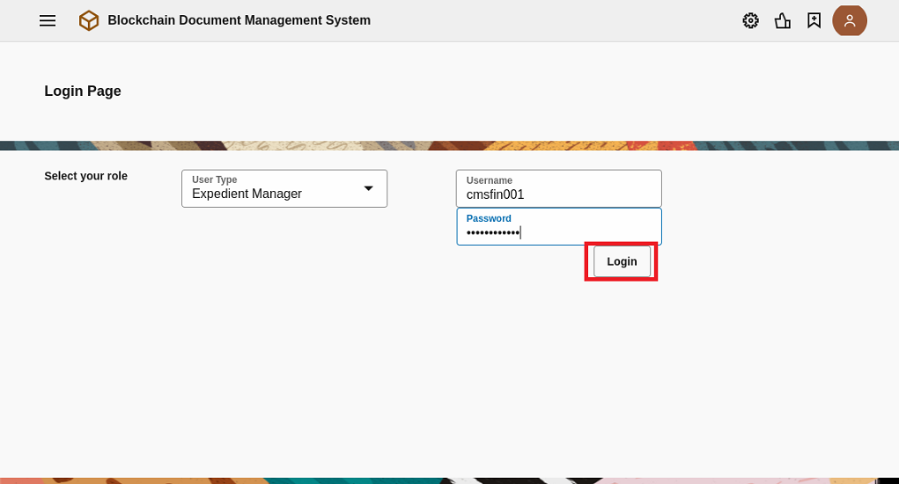

# Configuration, Deployment, and Test of the Web Application.

A Web Application has been developed and can be downloaded [here](./src/WEDO_CMS_1_0-1.0.1.zip). This application has been configured to point to a different Blockchain network and a different bucket, so you should do a few changes to be able to use this application pointing to your Blockhain Network and to the bucket you created in the previous chapter.

First of all we are going to acces to your Visual Builder Studio instance, where we will be able to import the provided Web Application. 

<a name="AccessVBS"/>
<details>
  
  <summary>1. Acces to Visual Builder Studio (click to show)</summary>
  
## 1. Acces to Visual Builder Studio

---
Visual Builder is not only used to develop Visual Builder applications, but it allows the development of any kind of modern application thanks to its multitude of integrated development tools, such as a GIT repository, CI/CD pipelines engine, artifact generation, container repository, agile tools, team building tools like wiki and snipples and more. If you want to know more please click [here](https://www.oracle.com/application-development/visual-builder-studio/)
	  
---
To get access to Visual Builder Studio (VBS) you have to Sign-in Oracle Cloud web console with your tenancy user credentials. Then Click in the *hamburguer icon* in the top left part of the web console and select **OCI Classic Services** then click in **Developer** to access to Visual Builder Studio instance.


  
Next you have to click in the VBS instance **menu icon** and click in the **Access Service Instance**  

> Note: In case there is no instance yet created, create a new instance, wait until gets created, and access to it. 
	
> IMPORTANT: Save the URL of this Visual Builder Studio instance, as it will be used in the following chapters.
  
  

</details>
<details>
  
  <summary>2. Import the provided application into Visual Builder Studio (click to show)</summary>
  
## 2. Import the provided application into Visual Builder Studio

First step inside Visual Builder studio is create a project. It can be done pushing the ***+ Create*** button in the default page (***Organization***) where you land first time you access to Visual Builder Studio. 


Give a Name to the project and push the ***Next*** button


	
As we will import an existing Visual Builder Appication, as a Project Template select an ***Empty Project*** and push the ***Next*** button.	


In the last screen of the wizzard, leave the defaul wiki markup language and push the ***Finish*** button. The new project will be created in no more than 5 minutes.


Once the Project gets created, the main page of the project will be shown. Before import our application we need to have an environment to configure and temporarilly run it. Click on the ***Create Environment*** button.


Give a name to the environment and a description and click on the ***Create*** button.


If there is any Visual Builder instance already in the tenancy, add it to this environment pushing the ***Add Instance*** button. 

>  Note: If you do not have any instance of Visual Builder, provision one and return to this point to add the instance to the Environment.


Select your VBCS instance and click on the ***Add*** Button. After that you will see how your environment with a VBCS environment tied to it are ready to be use.


Once the environment has been added to the project, we are going to create the ***Workspace***, where we will be able to import the precreated Web Application. 

Push the ***Workspace*** menu option in the left navigation menu. 


A workspace can be created just importing our VBCS Web Application into the project. Push the ***Import*** button.


Populate the Workspace creation wizzard page by providing:   
	- The zip file of the precreated VBCS Application  
	- A name for the workspace  
	- Select the environment we configured previously into the project to be use to test the application  
	- Create a new empty Git repository giving to it a name and a default branch name  

Once provided all the details, push the ***Import*** button.


    
</details>
<details>
  <summary>3. Configure the Web Application to point to your Blockchain instance and your Storage Bucket (click to show)</summary>

## 3. Configure the Web Application to point to your Blockchain instance and your Storage Bucket
In this chapter we are going to configure the provided Web Application to point to the Blockchain Instance we created in the chapter [Create an Oracle Blockchain Network
](https://github.com/jvillenap/CMS-Secured-by-Blockchain/blob/main/1-create-network/README.md), and to point the Object Storage Bucket we created in the chapter [Creation and Configuration of the OCI Storage Bucket](https://github.com/jvillenap/CMS-Secured-by-Blockchain/blob/main/4-bucket/README.md).

<details>
  <summary>3.1 Configure the Blockchain Network (click to show)</summary>
  
### 3.1 Configure the Blockchain Network.
First of all we need to recap all the information related with the Blockchain Network we defined in the first chapter [Create an Oracle Blockchain Network
](https://github.com/jvillenap/CMS-Secured-by-Blockchain/blob/main/1-create-network/README.md). If you followed the same terminology used in the HoL, following table shows this information:

|Field|Value|  
|-|-|
|BC Endpoint | https://org1-wedoinfra-fra.blockchain.ocp.oraclecloud.com:7443/ |
|Instance Name |org1|
|Channel | wedocms |
|Chaincode | WEDOCMS |

> Note: BC Endpoint is the only value which will vary for all the tenancies because the URL is composed based in some OCI tenancy values as we can see in the following URL:

```
    https://<InstanceName>-<TenancyName>-<RegionID>.blockchain.ocp.oraclecloud.com:7443/
```

When it is clear all this information, we can move forward and configure such parameters into our Web Application. It can be done opening the workspace we just created in Visual Builder Studio. So, first of all let's open the workspace by Accessing to our [Visual Builder Studio instance](#AccessVBS), and open the project you created by clicking in the name of the project from the default page where you land  (***Organization***) when you access to VBS.


Once inside the project, select the ***Workspace*** created when importing the provided Web Application.


Once inside the Workspace, let's move to the place where the variables defining with which Blockchain instance, channel and chaincode our app must interact.

First select the Web App Section (1), and then select the only existing Web App ***docmngmnt***) (2).


Once Opened the application, move to the ***variables*** tab.


  
And change the default value of the variables ***bcEndpoint***, ***bcInstance***, ***chaincode***, and ***channel***. It can be done easily just pushing the ***f(x)*** symbol in the top-left corner of the ***Default Value*** attribute for each of the variables.


Once selected any of the variables, and when the ***f(x)*** symbol gets clicked, the expression editor will be opened, where you will be able to set propperly the value of each property based in your environment.
  


Once changed all this parameters we can move forward to the next chapter!
  
</details>
<details>
  <summary>3.2 Configure the OCI Storage Bucket (click to show)</summary>

### 3.2 Configure the OCI Storage Bucket.

Now we are going to configure the bucket to be used by the Web Application based in the values of the API Key and Bucket we created in the chapter [Creation and Configuration of the OCI Storage Bucket](https://github.com/jvillenap/CMS-Secured-by-Blockchain/blob/main/4-bucket/README.md).

First select the ***Services Connection*** Section (1), and then select the ***fileUpload*** Service Connection (2).


Click in the ***Servers*** tab. 
  

  
In the Right side of the server configuration, Click on the ***Pencil*** icon to change the configuration of the ***fileUpload*** service Connection.
  


The configuration of the Service Connection used to interact with our bucket needs to be adapted in three places:


 1. ***Instance URL***: It needs to be changed to point to your Bucket based in a couple of properties from your OCI tenancy and the name you gave to the bucket when you created it. The URL must be composed based in the following URL template:
```
   https://objectstorage.<region-name>.oraclecloud.com/n/<storage-namespace>/b/<bucket-name>
```
The tenancy related values can be retrieved by accessing to the ***Tenancy Details*** Page from the OCI Console. You can reach this page from the OCI Console by pushing the ***Profile*** (1) icon in the top-right side of the console, and selecting the ***Tenancy Details*** (2) menu option:


... and the values ***Region Name*** (1) and ***Object Storage Namespace*** (2) can be obtained from this page:


 2. ***Authentication***: You must ensure the authentication method is set to ***Oracle Cloud Infrastructure API Signature 1.0***, and the key is set by pushing the Pencil icon in the right side of the ***Key Id*** property:


As you can see from the image, the ***Key Id*** is composed based in the following template:
```
   <Tenancy-OCID>/<User-OCID>/<Key-Fingerprint>
``` 
All this values can be obtained from the ***Configuration File Preview*** obtained when ***API Key*** was created in chapter [Creation and Configuration of the OCI Storage Bucket](https://github.com/jvillenap/CMS-Secured-by-Blockchain/blob/main/4-bucket/README.md).

***Private Key*** is the private key we Used/Generated/Downloaded (depending on the selected option) during the ***API Key*** creation.

 3. ***Connection Type***: Must be set to ***Dynamic, the service supports CORS***.

Once set all these three properties has been configured propperly accordingly with your ***Bucket*** and ***API Key***, the Web Application is completely ready to interact with your Storage Bucket.

Now, you can test the Application! 
</details>
    
</details>

<details>
  <summary>4. Test your Web Application (click to show)</summary>

## 4. Test your Web Application
Now you can test the application from the Visual Builder environment configured in our project. After we can see how everything works fine, we can move forward and export the Web Application to be deployed in an standalone box.

This Web Application interacts against the two backends used in the solution, it is Blockchain to store the expedients and the metadata of the documents, and the buckets of OCI storage for the documents content. So, we are going to test a couple of functionalities ensuring both backends (Blockchain and Bucket) are accessible through the Web Application.

To test the application, push the ***Preview*** icon in the top-right corner of the Visual Studio Workspace.


Login as an expedient manager, the user will be able to access to the expedients for which he/she is the current owner, 
	... or create a new expedient, for which he/she will be the current custodian.
	being able to add more documents into the expedient, or transfer the whole expedient to a different user/department.

Let's try to create an expedient, and upload a document to it.

First of all login as one of the users (cmsleg001, cmsfin001, or cmsrsk001) ensuring the role is set to ***Expedient Manager***, and push the ***Login*** button.



In the ***Expedient Management*** page, push the ***New Expedient*** button.


Assign values to the three input fields (***Expedient Type***, ***Description***, and ***Customer ID***) and click in the ***Create Expedient*** button.


In a few seconds, if the transctions is commited following message should appear in the page:


	
demo create new expedient

In any moment we can access to the Oracle Blockchain Service console to see how all the actions performed against the ledger, has been persisted in real time.

Also we can see how the uploaded documents has been saved into a bucket of our tennacy.


Login as a document reviewer, any user who has access to the app
	will be able to review documents from any expedient.


  
  
  
--- 
Once you have configured the mobile application in Oracle Visual Builder with the functionality that you want it to present to end users, plus the REST service connections to Oracle Content and Experience, you build it so that you can test it on a device or distribute it to end users. Oracle Visual Builder can build the following types of applications from the same mobile application source code:

* Android application
* iOS application
* Progressive web application (PWA)
  
For Android and iOS applications, you must define a build configuration before Oracle Visual Builder can build the mobile application for you (out of the scope of this workshop. You have more information about deploying native mobile application [here](https://docs.oracle.com/en/solutions/visual-builder-application-photos-to-content-experience-cloud/publish-mobile-application-oracle-visual-builder-vbcec1.html#GUID-6C813F64-6C74-4B50-9451-BC5CEC730122)). For a PWA, you must enable PWA in the PWA tab of the mobile app's Settings page. Once you complete the appropriate prerequisites, Oracle Visual Builder builds the mobile application you want.
  
When a mobile app with PWA support enabled is deployed using Oracle Visual Builder, the application runs as a web app and not as a native mobile app. End users access the app by navigating to the URL where the application is published.
  
Visual Builder has its own environment to deploy and test your PWA mobile application. With Visual Builder you can test your mobile application reading a QR image that will open the mobile web app in your mobile phone. Once tested you can publish it, in a simple way, to a Visual Builder production environment.
  
In this section you'll test your PWA mobile application in your own mobile phone (if you have one of course).
---

### Test your mobile application
To deploy a PWA application you must enable the PWA option in your mobile application Settings.

  Click **Mobile Apps** icon on the top left menu. Then select your mobile **app name** in the app tree. Next click **Settings** tab in the main top menu of your app tab. 
   
 
  
Select **PWA** tab and Enable it if it's disabled.
  
 
  
In the PWA settings you could change several values like the name for the application, write a description and change the color theme. You could upload resource files too, but you don't have to change anything for the workshop, leave it as default.
  
Select **Security** Tab to change the access to the PWA mobile app. Then check **Allow anonymous access** to allow using the app without any user and password requirement.
  
 
  
Click in the **main-start** tab or select it from the application tree, to return to the **Page Designer**.
  

  
In the Page Editor you have 3 buttons: Live, Design, Code over the phone layout. This tree buttons have different behaviours. You was using the **Design** button to enable the design editor to build the mobile app layout. **Code** button show you the html code of the layout designed. And the **Live** button let you test the mobile application in real time, but in your web browser instead of your mobile phone.
  
You can test your mobile app clicking in **Live**, but the idea is to test the application in your mobile phone. Click in the Play/Triangle icon in the Top main window, near the **Publish** button.
  

  
A new brouser tab or window should be opened (review your security settings about open new windows or tab in your browser if a new windows was not opened).
  

  
Click in **Build my App** button to build your mobile application and create the QR to test it in your own mobile phone. Then click in the **Share** button to deploy the mobile app and create the QR code.
  

  
Wait for a while. The build process takes several seconds, less than a minute normally. You should receive a confirmation message at the right bottom of the window. Sometimes the QR code is not visible.  
  

 
But if you refresh the browser (F5) you should see the QR code correctly.
  

  
Next read the QR code with you mobile phone to access to the application.
  

  
Finally test the application writing your name, a name for the photo and take a funny photo to upload to the Object Storage bucket. Open your Object Storage bucket to see your uploaded photo file or **Refresh** (in *More Actions*) the bucket if you have the bucket opened.
  

  
</details>
